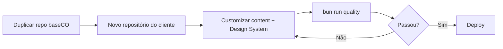

# Plano de Evolução — Boilerplate Template Copiável de Alta Performance

> **Objetivo:** Manter o **baseCO** como **template copiável** — um app Astro na raiz, duplicado por cliente — com **Lighthouse ≥ 95** em todas as categorias, acessibilidade WCAG 2.2 AA validada automaticamente, suítes e2e completas e **instruções para IA** que garantam consistência em cada nova landing.

> **Modelo de trabalho:** ao fechar um cliente, **copie este repositório inteiro** para um novo repo e customize lá.

**Documentos operacionais:** [`AGENTS.md`](../AGENTS.md) · [`NEW-LANDING-GUIDE.md`](NEW-LANDING-GUIDE.md) · [`docs/guidelines/`](guidelines/)

---

## Índice

1. [Visão Geral e Estado Atual](#1-visão-geral-e-estado-atual)
2. [Arquitetura do Template Copiável](#2-arquitetura-do-template-copiável)
3. [Core Web Vitals e Lighthouse > 95](#3-core-web-vitals-e-lighthouse--95)
4. [Code-Splitting e Lazy Loading](#4-code-splitting-e-lazy-loading)
5. [Acessibilidade (WCAG 2.2 AA)](#5-acessibilidade-wcag-22-aa)
6. [Automação de Acessibilidade](#6-automação-de-acessibilidade)
7. [Suítes de Testes E2E](#7-suítes-de-testes-e2e)
8. [CI/CD e Quality Gates](#8-cicd-e-quality-gates)
9. [Instruções para IA (Guidelines)](#9-instruções-para-ia-guidelines)
10. [Roadmap de Implementação](#10-roadmap-de-implementação)
11. [Checklist de Entrega por Landing Page](#11-checklist-de-entrega-por-landing-page)

---

## 1. Visão Geral e Estado Atual

### O que já existe

| Área                | Status | Observação                                                                         |
| ------------------- | ------ | ---------------------------------------------------------------------------------- |
| **Framework**       | ✅     | Astro 5 estático, Sharp, `compressHTML`, `@astrojs/sitemap`                        |
| **SEO**             | ✅     | JSON-LD, meta-tags, canonical, sitemap, `robots.txt`                               |
| **OG image**        | ✅     | `public/og-default.jpg` (1200×630)                                                 |
| **Acessibilidade**  | ✅     | Skip link, landmarks, menu mobile, focus trap, `Button`/`Dialog`, `aria-current`   |
| **Hero LCP**        | ✅     | Raster WebP via `astro:assets` (`src/assets/hero.webp`)                            |
| **Lazy loading**    | ✅     | `LazySection.astro`, island `MobileMenu` com `client:media`                        |
| **Testes e2e**      | ✅     | Playwright, axe-core, teclado, SEO, fluxos, visual                                 |
| **Lighthouse CI**   | ✅     | `lighthouserc.json`, `testing/lighthouse-budget.json`, `scripts/run-lighthouse.ts` |
| **pa11y-ci**        | ✅     | `scripts/validate-a11y.ts`, `.pa11yci.json`                                        |
| **CI**              | ✅     | `.github/workflows/quality.yml` (Bun)                                              |
| **Guidelines + IA** | ✅     | `AGENTS.md`, `docs/guidelines/`, `docs/templates/`                                 |
| **Lint / format**   | ✅     | ESLint 9 + jsx-a11y + Prettier + Husky pre-commit                                  |
| **Deploy**          | ✅     | `docs/DEPLOY.md` (Netlify, Cloudflare, Vercel)                                     |

Legenda: ✅ concluído · ⏳ parcial ou pendente

### Princípios do boilerplate

1. **Zero regressão** — Toda entrega deve passar `bun run quality`.
2. **Separação conteúdo × visual** — Conteúdo em Content Collections; visual via Design System externo (hooks CSS).
3. **Progressive enhancement** — Site funcional sem JS; interatividade via islands sob demanda.
4. **IA como co-desenvolvedora** — Regras explícitas em `AGENTS.md` e `docs/guidelines/`.
5. **Um repo por cliente** — Duplicar o template; não acumular clientes no mesmo repositório.

---

## 2. Arquitetura do Template Copiável

### Modelo

**Template copiável** — um cliente, um repositório, customização livre. Duplique o repo e customize conteúdo + visual.

### Estrutura de diretórios

```
baseCO/                         # copiar este repo para cada cliente
├── src/
│   ├── components/             # Header, Hero, Features, LazySection, primitives/, islands/
│   ├── seo/                    # LocalBusinessJsonLd.astro, types.ts
│   ├── layouts/                # Layout.astro
│   ├── pages/                  # Rotas Astro
│   ├── content/                # JSON + schemas Zod (Decap CMS)
│   ├── styles/                 # global.css, a11y.css
│   └── assets/                 # Imagens (astro:assets)
├── e2e/
│   ├── helpers/                # axe-setup.ts, seo-assertions.ts
│   ├── a11y/                   # all-routes.spec.ts, keyboard-nav.spec.ts
│   └── seo/                    # all-routes.spec.ts, robots.spec.ts
├── public/
│   ├── admin/                  # Decap CMS
│   ├── assets/uploads/
│   └── og-default.jpg
├── scripts/
│   ├── run-lighthouse.ts
│   └── validate-a11y.ts
├── testing/
│   └── lighthouse-budget.json
├── docs/
│   ├── guidelines/
│   ├── templates/
│   ├── NEW-LANDING-GUIDE.md
│   └── PLANO-BOILERPLATE-CORPORATIVO.md
├── .github/workflows/quality.yml
├── AGENTS.md
├── astro.config.mjs
├── playwright.config.ts
├── lighthouserc.json
├── .pa11yci.json
├── eslint.config.js
├── tailwind.config.mjs
└── package.json
```

### Scripts (`package.json`)

```json
{
  "scripts": {
    "dev": "astro dev",
    "build": "astro build",
    "preview": "astro preview",
    "preview:e2e": "astro build && astro preview --port 4321",
    "lint": "eslint src/ e2e/ scripts/",
    "test:e2e": "playwright test",
    "lighthouse": "bun scripts/run-lighthouse.ts",
    "a11y": "bun scripts/validate-a11y.ts",
    "quality": "bun run lint && bun run build && bun run test:e2e && bun run a11y && bun run lighthouse"
  }
}
```

### Fluxo para nova landing de cliente



Passo a passo detalhado: [`NEW-LANDING-GUIDE.md`](NEW-LANDING-GUIDE.md).

---

## 3. Core Web Vitals e Lighthouse > 95

### Metas por métrica

| Métrica                       | Alvo (campo) | Alvo (lab/Lighthouse) | Responsável técnico                |
| ----------------------------- | ------------ | --------------------- | ---------------------------------- |
| **LCP**                       | ≤ 2.0s       | ≤ 1.8s                | Hero image, fontes, build estático |
| **INP**                       | ≤ 150ms      | ≤ 100ms               | JS mínimo, islands sob demanda     |
| **CLS**                       | ≤ 0.05       | ≤ 0.02                | dimensões explícitas, font-display |
| **FCP**                       | ≤ 1.5s       | ≤ 1.2s                | CSS crítico inline, preconnect     |
| **TTFB**                      | ≤ 600ms      | CDN + estático        | Hospedagem (Netlify/Cloudflare)    |
| **Lighthouse (4 categorias)** | —            | ≥ 95 cada             | Seções 3–6 + quality gates         |

### 3.1 LCP (Largest Contentful Paint)

**Ações concretas:**

1. **Hero image** — ✅ raster WebP em `src/assets/hero.webp` (substituir por foto do cliente).
2. Manter `loading="eager"`, `fetchpriority="high"`, `decoding="async"`.
3. `width` e `height` explícitos para reservar espaço (anti-CLS).
4. **Fontes** — `font-display: swap`, subset WOFF2, `preconnect` no `Layout.astro`.
5. **CSS crítico** — `inlineStylesheets: 'auto'` no `astro.config.mjs`.

### 3.2 INP (Interaction to Next Paint)

1. **Islands** — Menu mobile com `client:media="(max-width: 768px)"`.
2. **Zero JS no critical path** — Nenhum `<script>` bloqueante no `<head>`.
3. Event delegation e debounce em validações de formulário, se houver.

### 3.3 CLS (Cumulative Layout Shift)

1. `width`/`height` em todas as imagens e iframes.
2. `aspect-ratio` CSS em containers de mídia.
3. Evitar injeção de conteúdo acima da dobra após load.

### 3.4 Otimizações de build e entrega

| Técnica                | Implementação                                                   |
| ---------------------- | --------------------------------------------------------------- |
| Compressão Brotli/Gzip | Netlify/Cloudflare (automático)                                 |
| Cache headers          | `immutable` para `/_assets/*`                                   |
| `compressHTML: true`   | Ativo no Astro                                                  |
| Tree-shaking           | Vite (padrão Astro)                                             |
| Purge CSS              | Tailwind `content` apontando para `src/**/*.{astro,html,js,ts}` |
| Sitemap                | `@astrojs/sitemap` ✅                                           |
| robots.txt             | ✅ `public/robots.txt`                                          |
| Resource hints         | `preconnect` para fontes no Layout                              |

### 3.5 Lighthouse CI e Performance Budget

**Config:** `lighthouserc.json` na raiz · budget em `testing/lighthouse-budget.json`

```json
{
  "ci": {
    "collect": {
      "staticDistDir": "./dist",
      "numberOfRuns": 3,
      "settings": {
        "budgets": "./testing/lighthouse-budget.json"
      }
    },
    "assert": {
      "assertions": {
        "categories:performance": ["error", { "minScore": 0.95 }],
        "categories:accessibility": ["error", { "minScore": 0.95 }],
        "categories:best-practices": ["error", { "minScore": 0.95 }],
        "categories:seo": ["error", { "minScore": 0.95 }],
        "largest-contentful-paint": ["error", { "maxNumericValue": 1800 }],
        "cumulative-layout-shift": ["error", { "maxNumericValue": 0.02 }],
        "total-blocking-time": ["error", { "maxNumericValue": 150 }]
      }
    }
  }
}
```

**Budget de recursos** (`testing/lighthouse-budget.json`):

```json
[
  { "resourceType": "script", "budget": 80 },
  { "resourceType": "stylesheet", "budget": 30 },
  { "resourceType": "image", "budget": 200 },
  { "resourceType": "total", "budget": 350 }
]
```

Execução local: `bun run lighthouse`

---

## 4. Code-Splitting e Lazy Loading

### Estratégia por camada (Astro)

Astro faz **split automático por rota** e por **island**. O plano formaliza quando usar cada padrão.

### 4.1 Componentes estáticos (`.astro`)

| Componente       | Estratégia                                       | Motivo                  |
| ---------------- | ------------------------------------------------ | ----------------------- |
| `Header`, `Hero` | Import estático                                  | Above the fold          |
| `Features`       | Import estático                                  | Visível cedo em mobile  |
| `Testimonials`   | `LazySection` ou import dinâmico                 | Abaixo da dobra         |
| `Contact`        | Estático (form nativo) ou island se validação JS | Interatividade opcional |
| `Footer`         | Import estático                                  | Leve, sempre presente   |

**Padrão para seções below-the-fold:**

```astro
---
import LazySection from "~/components/LazySection.astro";
import Testimonials from "~/components/Testimonials.astro";
---

<LazySection>
  <Testimonials />
</LazySection>
```

`LazySection.astro` usa `IntersectionObserver` para renderizar o slot quando visível.

### 4.2 Astro Islands (componentes interativos)

```astro
---
import MobileMenuIsland from "~/components/islands/MobileMenuIsland.astro";
---

<MobileMenuIsland client:media="(max-width: 768px)" />
```

| Diretiva         | Uso                                     |
| ---------------- | --------------------------------------- |
| `client:load`    | Evitar — só se crítico para UX imediata |
| `client:idle`    | Toggles secundários                     |
| `client:visible` | Carrosséis, formulários, mapas          |
| `client:media`   | Menu mobile ✅                          |
| `client:only`    | Último recurso                          |

### 4.3 Imagens

Regra: **apenas 1 imagem com `loading="eager"` por página** (candidata LCP).

### 4.4 Fontes e CSS

- Design System do cliente no bloco **DESIGN SYSTEM OVERRIDES** de `src/styles/global.css`.
- CSS não-crítico via `<link rel="stylesheet" media="print" onload="...">` com fallback `<noscript>`.

### 4.5 Scripts de terceiros

Carregar analytics após `requestIdleCallback` ou timeout — nunca bloqueante no `<head>`.

---

## 5. Acessibilidade (WCAG 2.2 AA)

### Nível alvo

**WCAG 2.2 Nível AA** (aspiração AAA em contraste do texto principal).

### 5.1 Checklist por componente

#### Layout global (`Layout.astro`)

- [x] `lang` no `<html>`
- [x] Skip link funcional (`SkipLink.astro`)
- [x] `<title>` único por página
- [x] `prefers-reduced-motion` em `global.css`

#### Header / Navegação

- [x] `aria-expanded`, `aria-controls` no menu mobile
- [x] Focus trap no menu aberto
- [x] Fechar menu com `Escape`
- [x] Landmark `<nav aria-label="Principal">`
- [x] `aria-current="page"` no link ativo

#### Hero

- [x] `aria-labelledby` na section
- [x] `h1` único por página
- [x] `aria-label` em CTAs quando necessário

#### Contact / Formulário

- [x] Labels associados (`for`/`id`)
- [ ] Mensagens de erro com `aria-describedby` + `aria-invalid` (quando houver validação JS)
- [x] Foco visível (`:focus-visible` em `a11y.css`)

### 5.2 Tokens de acessibilidade

Arquivo: `src/styles/a11y.css` — foco visível, utilitários sr-only, reduced motion.

### 5.3 Primitivos a11y (`src/components/primitives/`)

| Primitivo              | Status | Função                                        |
| ---------------------- | ------ | --------------------------------------------- |
| `SkipLink.astro`       | ✅     | Pular para `#main-content`                    |
| `VisuallyHidden.astro` | ✅     | Texto só para leitores de tela                |
| `Button.astro`         | ✅     | `<button>` vs `<a>` correto, estados disabled |
| `Dialog.astro`         | ✅     | Modal nativo `<dialog>` + focus trap + Escape |
| `LiveRegion.astro`     | ⏳     | `aria-live` para feedback dinâmico            |

---

## 6. Automação de Acessibilidade

### Stack de ferramentas

| Ferramenta                 | Escopo               | Quando roda                     |
| -------------------------- | -------------------- | ------------------------------- |
| **eslint-plugin-jsx-a11y** | Islands TSX/JSX      | CI (`bun run lint`)             |
| **@axe-core/playwright**   | Páginas renderizadas | `bun run test:e2e`              |
| **pa11y-ci**               | HTML buildado        | `bun run a11y`                  |
| **Testes de teclado**      | Fluxos críticos      | `e2e/a11y/keyboard-nav.spec.ts` |

### 6.1 Integração axe-core + Playwright

Helper: `e2e/helpers/axe-setup.ts`

```typescript
import AxeBuilder from "@axe-core/playwright";
import type { Page } from "@playwright/test";

export async function assertNoA11yViolations(page: Page) {
  const results = await new AxeBuilder({ page })
    .withTags(["wcag2a", "wcag2aa", "wcag21aa", "wcag22aa"])
    .analyze();
  expect(results.violations).toEqual([]);
}
```

Teste: `e2e/a11y/all-routes.spec.ts`

### 6.2 Testes de navegação por teclado

Cenários de teclado: `e2e/a11y/keyboard-nav.spec.ts`

| Cenário     | Resultado esperado                  |
| ----------- | ----------------------------------- |
| Skip link   | Foco em `#main-content`             |
| Menu mobile | Abre com Enter, fecha com Escape    |
| Focus trap  | Tab permanece dentro do menu aberto |
| Formulário  | Ordem de foco lógica                |

### 6.3 Script pa11y pós-build

```bash
bun run a11y   # scripts/validate-a11y.ts → preview :4322 + pa11y-ci
```

Config: `.pa11yci.json` (homepage em `dist/`).

---

## 7. Suítes de Testes E2E

### Stack

| Ferramenta               | Papel                                          |
| ------------------------ | ---------------------------------------------- |
| **Playwright**           | E2E multi-browser (Chromium desktop + Pixel 7) |
| **@axe-core/playwright** | A11y integrado aos e2e                         |
| **Helpers locais**       | `e2e/helpers/`                                 |

### Estrutura atual

```
e2e/
├── helpers/
│   ├── axe-setup.ts
│   └── seo-assertions.ts
├── a11y/
│   ├── all-routes.spec.ts
│   └── keyboard-nav.spec.ts
└── seo/
    ├── all-routes.spec.ts
    └── robots.spec.ts
```

### Cenários obrigatórios por landing

| Área      | O que testar                                         |
| --------- | ---------------------------------------------------- |
| SEO       | `title`, `meta description`, JSON-LD `LocalBusiness` |
| A11y      | axe-core 0 violações em `/`                          |
| Teclado   | Skip link, menu mobile, formulário                   |
| Landmarks | 1× `main`, 1× `h1`, `nav[aria-label]`                |

### Configuração Playwright

`playwright.config.ts` na raiz — `webServer` usa `bun run preview:e2e` na porta 4321.

### Expansões futuras (Fase 4)

- `e2e/flows/` — navegação por âncoras, 404
- `e2e/visual/` — regression visual (opcional)

---

## 8. CI/CD e Quality Gates

### Pipeline GitHub Actions

Arquivo: `.github/workflows/quality.yml`

| Step       | Comando                         |
| ---------- | ------------------------------- |
| Install    | `bun install --frozen-lockfile` |
| Lint       | `bun run lint`                  |
| Build      | `bun run build`                 |
| E2E        | `bun run test:e2e`              |
| pa11y      | `bun run a11y`                  |
| Lighthouse | `bun run lighthouse`            |

Artefatos: `playwright-report/`, `reports/lighthouse/`

### Regras de merge

| Gate                           | Bloqueia merge?         |
| ------------------------------ | ----------------------- |
| ESLint (incl. jsx-a11y)        | Sim                     |
| Build sem erros                | Sim                     |
| Playwright e2e                 | Sim                     |
| axe-core (0 violações)         | Sim                     |
| pa11y-ci (0 erros)             | Sim                     |
| Lighthouse ≥ 95 (4 categorias) | Sim                     |
| Bundle budget                  | Sim (via Lighthouse CI) |

### Pre-commit ✅

Husky + lint-staged: ESLint + Prettier nos arquivos staged (`.husky/pre-commit`).

---

## 9. Instruções para IA (Guidelines)

### 9.1 Estrutura de arquivos

```
docs/guidelines/
├── 00-project-context.md
├── 10-performance-cwv.md
├── 20-accessibility.md
├── 30-astro-components.md
├── 31-content-collections.md
├── 40-seo-local.md
├── 50-testing-e2e.md
└── 60-new-landing.md

AGENTS.md                    # entrada para IA (raiz)
docs/NEW-LANDING-GUIDE.md    # passo a passo novo cliente
docs/templates/              # snippets copiáveis
```

### 9.2 `AGENTS.md`

Ponto de entrada — stack, estrutura plana, comandos (`bun run quality`), o que evitar.

### 9.3 Templates

| Template                | Arquivo                                         |
| ----------------------- | ----------------------------------------------- |
| Novo componente Astro   | `docs/templates/component.astro.template`       |
| Nova seção below-fold   | `docs/templates/lazy-section.astro.template`    |
| Novo teste a11y         | `docs/templates/a11y-spec.ts.template`          |
| Nova content collection | `docs/templates/content-collection.ts.template` |

---

## 10. Roadmap de Implementação

### Fase 1 — Fundação do template ✅

| #   | Tarefa                       | Entregável                      | Status |
| --- | ---------------------------- | ------------------------------- | ------ |
| 1.1 | Estrutura plana na raiz      | `src/`, `e2e/`, `public/`       | ✅     |
| 1.2 | Componentes de seção         | `src/components/*`              | ✅     |
| 1.3 | SEO / JSON-LD                | `src/seo/`                      | ✅     |
| 1.4 | ESLint + Prettier + jsx-a11y | `eslint.config.js`              | ✅     |
| 1.5 | Playwright + teste SEO       | `e2e/seo/all-routes.spec.ts`    | ✅     |
| 1.6 | axe-core no e2e              | `e2e/a11y/all-routes.spec.ts`   | ✅     |
| 1.7 | Guidelines + AGENTS.md       | `docs/guidelines/`, `AGENTS.md` | ✅     |
| 1.8 | OG image raster              | `public/og-default.jpg`         | ✅     |

### Fase 2 — Performance e quality gates ✅

| #   | Tarefa                           | Entregável                                            | Status |
| --- | -------------------------------- | ----------------------------------------------------- | ------ |
| 2.1 | Lighthouse CI + budgets          | `lighthouserc.json`, `testing/lighthouse-budget.json` | ✅     |
| 2.2 | LazySection + menu mobile island | `LazySection.astro`, `MobileMenuIsland`               | ✅     |
| 2.3 | Primitivos a11y base             | `SkipLink`, `VisuallyHidden`, `a11y.css`              | ✅     |
| 2.4 | Testes de teclado                | `keyboard-nav.spec.ts`                                | ✅     |
| 2.5 | GitHub Actions                   | `.github/workflows/quality.yml`                       | ✅     |
| 2.6 | pa11y-ci pós-build               | `scripts/validate-a11y.ts`                            | ✅     |
| 2.7 | Sitemap automático               | `@astrojs/sitemap`                                    | ✅     |

### Fase 3 — DX do cliente ✅

| #   | Tarefa                                    | Entregável                                                      | Status |
| --- | ----------------------------------------- | --------------------------------------------------------------- | ------ |
| 3.1 | Guia passo a passo                        | `docs/NEW-LANDING-GUIDE.md`                                     | ✅     |
| 3.2 | Guidelines completos                      | `docs/guidelines/10–60`                                         | ✅     |
| 3.3 | Templates copiáveis                       | `docs/templates/`                                               | ✅     |
| 3.4 | Checklist novo cliente                    | `docs/guidelines/60-new-landing.md`                             | ✅     |
| 3.5 | Script `quality` unificado                | `package.json`                                                  | ✅     |
| 3.6 | Índice de documentação                    | `docs/GUIA-DOS-ARQUIVOS.md`                                     | ✅     |
| 3.7 | Guardrails para novas páginas/componentes | `70-new-page-component.md`, `all-routes` e2e, `discover-routes` | ✅     |

### Fase 4 — Polimento ✅

| #   | Tarefa                          | Entregável                   | Status |
| --- | ------------------------------- | ---------------------------- | ------ |
| 4.1 | Hero LCP em raster (AVIF/WebP)  | `src/assets/hero.webp`       | ✅     |
| 4.2 | `robots.txt`                    | `public/robots.txt`          | ✅     |
| 4.3 | Primitivos `Button` + `Dialog`  | `src/components/primitives/` | ✅     |
| 4.4 | `aria-current="page"` no nav    | `Header.astro`               | ✅     |
| 4.5 | Pre-commit Husky + lint-staged  | `.husky/`                    | ✅     |
| 4.6 | Testes e2e de fluxos            | `e2e/flows/`                 | ✅     |
| 4.7 | Visual regression (opcional)    | `e2e/visual/`                | ✅     |
| 4.8 | Documentação de deploy por host | `docs/DEPLOY.md`             | ✅     |
| 4.9 | Monitoramento RUM (web-vitals)  | doc opcional em `DEPLOY.md`  | ✅     |

---

## 11. Checklist de Entrega por Landing Page

Use em toda entrega de cliente (humano ou IA). Detalhes em [`NEW-LANDING-GUIDE.md`](NEW-LANDING-GUIDE.md).

### Performance

- [ ] Lighthouse Performance ≥ 95 (mobile, throttling 4G)
- [ ] LCP ≤ 1.8s | CLS ≤ 0.02 | INP ≤ 150ms
- [ ] Apenas 1 imagem `eager` + `fetchpriority="high"`
- [ ] Fontes com `font-display: swap` e preload
- [ ] Bundle JS total ≤ 80 KB (gzip)
- [ ] Sem erros 4xx/5xx em recursos

### Acessibilidade

- [ ] Lighthouse Accessibility ≥ 95
- [ ] axe-core: 0 violações WCAG 2.2 AA
- [ ] pa11y-ci: 0 erros
- [ ] Testes de teclado passando
- [ ] Skip link funcional
- [ ] Contraste validado (texto ≥ 4.5:1)

### SEO

- [ ] Lighthouse SEO ≥ 95
- [ ] JSON-LD LocalBusiness validado (Google Rich Results Test)
- [ ] `title`, `description`, `canonical` únicos
- [ ] OG image JPG/WebP 1200×630
- [ ] `sitemap.xml` gerado
- [ ] `robots.txt` com Sitemap do domínio do cliente

### Testes

- [ ] `bun run test:e2e` passando (desktop + mobile)
- [ ] `bun run quality` passando localmente ou no CI

### Conteúdo e CMS

- [ ] `home.json` preenchido e validado por Zod
- [ ] Decap CMS configurado para repo do cliente
- [ ] Imagens otimizadas em `public/assets/`

### Documentação

- [ ] `docs/guidelines/60-new-landing.md` seguido
- [ ] README do cliente atualizado com URL e instruções CMS

---

## Dependências (referência)

```json
{
  "dependencies": {
    "@astrojs/sitemap": "^3.2",
    "@astrojs/tailwind": "^5.1",
    "astro": "^5.1",
    "sharp": "^0.33",
    "tailwindcss": "^3.4"
  },
  "devDependencies": {
    "@axe-core/playwright": "^4.10",
    "@lhci/cli": "^0.14",
    "@playwright/test": "^1.49",
    "eslint": "^9",
    "eslint-plugin-astro": "^1",
    "eslint-plugin-jsx-a11y": "^6.10",
    "pa11y-ci": "^3.1",
    "prettier": "^3",
    "prettier-plugin-astro": "^0.14",
    "typescript": "^5.7"
  }
}
```

Gerenciador: **Bun** (`bun.lock` versionado).

---

## Referências

- [Web Vitals](https://web.dev/vitals/)
- [WCAG 2.2](https://www.w3.org/TR/WCAG22/)
- [Astro Performance](https://docs.astro.build/en/guides/performance/)
- [Astro Islands](https://docs.astro.build/en/concepts/islands/)
- [Playwright + axe](https://playwright.dev/docs/accessibility-testing)
- [Lighthouse CI](https://github.com/GoogleChrome/lighthouse-ci)

---

_Documento vivo — atualizar conforme fases forem concluídas. Última revisão: junho/2026 (modelo template copiável)._
