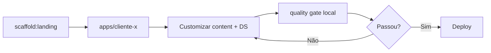

# Plano de Evolução — Boilerplate Monorepo Corporativo de Alta Performance

> **Objetivo:** Transformar o `seo-base` (Astro 5 + Tailwind + Decap CMS) em um boilerplate corporativo reutilizável para landing pages de pequenos negócios, com **Lighthouse > 95 em todas as categorias**, acessibilidade WCAG 2.2 AA validada automaticamente, monorepo escalável e suítes de testes e2e completas — incluindo **instruções para IA** que garantam consistência em cada nova implementação.

---

## Índice

1. [Visão Geral e Estado Atual](#1-visão-geral-e-estado-atual)
2. [Arquitetura Alvo do Monorepo](#2-arquitetura-alvo-do-monorepo)
3. [Core Web Vitals e Lighthouse > 95](#3-core-web-vitals-e-lighthouse--95)
4. [Code-Splitting e Lazy Loading](#4-code-splitting-e-lazy-loading)
5. [Acessibilidade (WCAG 2.2 AA)](#5-acessibilidade-wcag-22-aa)
6. [Automação de Acessibilidade](#6-automação-de-acessibilidade)
7. [Suítes de Testes E2E](#7-suítes-de-testes-e2e)
8. [CI/CD e Quality Gates](#8-cicd-e-quality-gates)
9. [Instruções para IA (Guidelines)](#9-instruções-para-ia-guidelines)
10. [Roadmap de Implementação](#10-roadmap-de-implementação)
11. [Checklist de Entrega por Landing Page](#11-checklist-de-entrega-por-landing-page)

---

## 1. Visão Geral e Estado Atual

### O que já existe

| Área | Status atual | Gap para o alvo |
|------|--------------|-----------------|
| **Framework** | Astro 5 estático, Sharp, compressHTML | Falta budget de performance, relatórios Lighthouse automatizados |
| **SEO** | JSON-LD LocalBusiness, meta-tags dinâmicas, canonical | OG image ainda em SVG (trocar por JPG/WebP 1200×630) |
| **Acessibilidade** | Skip link, landmarks, ARIA no menu mobile, `prefers-reduced-motion` | Sem auditoria automatizada, sem testes de teclado |
| **Performance** | `loading="eager"` + `fetchpriority="high"` no Hero LCP | Sem lazy loading de seções abaixo da dobra, sem code-splitting explícito |
| **Testes** | Nenhum | Zero cobertura e2e, zero axe-core |
| **Monorepo** | Repositório único | Sem workspaces, sem pacotes compartilhados, sem Turborepo/Nx |
| **IA / Padrões** | Comentários nos componentes | `docs/guidelines/`, `AGENTS.md`, templates |

### Princípios do boilerplate

1. **Zero regressão** — Toda PR deve passar por quality gates (Lighthouse, axe, e2e).
2. **Separação conteúdo × visual** — Conteúdo em Content Collections; visual via Design System externo (hooks CSS já existentes).
3. **Progressive enhancement** — Site funcional sem JS; interatividade carregada sob demanda.
4. **IA como co-desenvolvedora** — Regras explícitas para que agentes sigam os mesmos padrões em cada landing nova.

---

## 2. Arquitetura Alvo do Monorepo

### Decisão: Turborepo (recomendado)

| Critério | Turborepo | Nx |
|----------|-----------|-----|
| Curva de aprendizado | Baixa | Média-alta |
| Adequação ao stack Astro estático | Excelente | Excelente, mas mais opinativo |
| Cache remoto | Sim (Vercel) | Sim (Nx Cloud) |
| Overhead para LP simples | Mínimo | Maior (plugins, generators) |
| Integração Bun/pnpm | Nativa | Nativa |

**Recomendação:** **Turborepo** com **pnpm workspaces** (ou Bun workspaces, mantendo compatibilidade). Nx só se no futuro houver apps React Native, backends NestJS ou necessidade de generators complexos.

### Estrutura de diretórios proposta

```
seo-base/                              # raiz do monorepo
├── apps/
│   ├── template-landing/              # app atual migrado (referência)
│   │   ├── src/
│   │   ├── public/
│   │   ├── astro.config.mjs
│   │   └── package.json
│   └── storybook/                     # (opcional Fase 3) catálogo de componentes
│
├── packages/
│   ├── ui/                            # componentes Astro compartilhados
│   │   ├── src/
│   │   │   ├── Header.astro
│   │   │   ├── Hero.astro
│   │   │   ├── primitives/            # Button, Link, SkipLink, VisuallyHidden
│   │   │   └── index.ts
│   │   ├── package.json
│   │   └── tsconfig.json
│   │
│   ├── seo/                           # JSON-LD, meta helpers, sitemap utils
│   │   ├── src/
│   │   │   ├── LocalBusinessJsonLd.astro
│   │   │   ├── schemas/
│   │   │   └── utils/
│   │   └── package.json
│   │
│   ├── content-schemas/               # Zod schemas compartilhados (homepage, blog, etc.)
│   │   └── package.json
│   │
│   ├── config/                        # configs compartilhadas
│   │   ├── eslint/
│   │   ├── tailwind/
│   │   ├── typescript/
│   │   └── lighthouse/
│   │
│   └── testing/                       # utilitários de teste compartilhados
│       ├── axe-setup.ts
│       ├── keyboard-helpers.ts
│       └── lighthouse-budget.json
│
├── tooling/
│   ├── scripts/
│   │   ├── scaffold-landing.ts        # CLI para nova LP de cliente
│   │   └── validate-a11y.ts
│   └── github-actions/                # workflows reutilizáveis
│
├── docs/
│   ├── guidelines/                 # Padrões de desenvolvimento
│   ├── PLANO-BOILERPLATE-CORPORATIVO.md   # este arquivo
│   ├── PERFORMANCE.md
│   ├── ACCESSIBILITY.md
│   └── NEW-LANDING-GUIDE.md
│
├── AGENTS.md                          # contexto global para agentes de IA
├── turbo.json
├── pnpm-workspace.yaml
├── package.json
└── README.md
```

### Configuração Turborepo (`turbo.json`)

```json
{
  "$schema": "https://turbo.build/schema.json",
  "tasks": {
    "build": {
      "dependsOn": ["^build"],
      "outputs": ["dist/**"]
    },
    "dev": {
      "cache": false,
      "persistent": true
    },
    "lint": {
      "dependsOn": ["^build"]
    },
    "test": {
      "dependsOn": ["build"]
    },
    "test:e2e": {
      "dependsOn": ["build"]
    },
    "lighthouse": {
      "dependsOn": ["build"],
      "outputs": ["reports/lighthouse/**"]
    },
    "a11y": {
      "dependsOn": ["build"]
    }
  }
}
```

### Scripts raiz (`package.json`)

```json
{
  "scripts": {
    "dev": "turbo dev",
    "build": "turbo build",
    "lint": "turbo lint",
    "test": "turbo test",
    "test:e2e": "turbo test:e2e",
    "lighthouse": "turbo lighthouse",
    "a11y": "turbo a11y",
    "scaffold:landing": "bun tooling/scripts/scaffold-landing.ts",
    "quality": "turbo lint test test:e2e lighthouse a11y"
  }
}
```

### Fluxo para nova landing de cliente



---

## 3. Core Web Vitals e Lighthouse > 95

### Metas por métrica

| Métrica | Alvo (campo) | Alvo (lab/Lighthouse) | Responsável técnico |
|---------|--------------|----------------------|---------------------|
| **LCP** | ≤ 2.0s | ≤ 1.8s | Hero image, fontes, SSR estático |
| **INP** | ≤ 150ms | ≤ 100ms | JS mínimo, islands sob demanda |
| **CLS** | ≤ 0.05 | ≤ 0.02 | dimensões explícitas, font-display |
| **FCP** | ≤ 1.5s | ≤ 1.2s | CSS crítico inline, preconnect |
| **TTFB** | ≤ 600ms | CDN + estático | Hospedagem (Netlify/Cloudflare) |
| **Lighthouse Performance** | — | ≥ 95 | Todas as otimizações abaixo |
| **Lighthouse Accessibility** | — | ≥ 95 | Seção 5 e 6 |
| **Lighthouse Best Practices** | — | ≥ 95 | HTTPS, imagens, console limpo |
| **Lighthouse SEO** | — | ≥ 95 | Já forte; reforçar OG image raster |

### 3.1 LCP (Largest Contentful Paint)

**Ações concretas:**

1. **Hero image**
   - Migrar de SVG para **AVIF/WebP raster** (1200px largura máx.) via `astro:assets`.
   - Manter `loading="eager"`, `fetchpriority="high"`, `decoding="async"`.
   - Adicionar `width` e `height` explícitos para reservar espaço (anti-CLS).

2. **Preload do LCP**
   ```html
   <link rel="preload" as="image" href="/_assets/hero-800w.avif"
         imagesrcset="..." imagesizes="(min-width: 768px) 50vw, 100vw" />
   ```

3. **Fontes**
   - `font-display: swap` obrigatório.
   - Subset WOFF2 apenas com glifos usados (latin + acentos pt-BR).
   - `preconnect` para origem de fontes no `Layout.astro` (bloco já reservado).

4. **CSS crítico**
   - Manter `inlineStylesheets: 'auto'` no `astro.config.mjs`.
   - Avaliar `@astrojs/critters` ou inline manual do CSS above-the-fold (Header + Hero).

### 3.2 INP (Interaction to Next Paint)

**Ações concretas:**

1. **Islands Architecture** — Menu mobile, formulário de contato e animações como Astro Islands com `client:visible` ou `client:idle`.
2. **Zero JS no critical path** — Nenhum `<script>` bloqueante no `<head>`.
3. **Event delegation** — Um listener por tipo de evento, não por elemento.
4. **Debounce em inputs** — Se houver validação em tempo real no formulário.

### 3.3 CLS (Cumulative Layout Shift)

**Ações concretas:**

1. `width`/`height` em **todas** as imagens e iframes.
2. `aspect-ratio` CSS em containers de mídia.
3. Reservar espaço para banners de cookie (se adicionados no futuro).
4. Evitar injeção de conteúdo acima da dobra após load (ads, popups).

### 3.4 Otimizações de build e entrega

| Técnica | Implementação |
|---------|---------------|
| Compressão Brotli/Gzip | Netlify/Cloudflare (automático) |
| Cache headers | `Cache-Control: public, max-age=31536000, immutable` para `/_assets/*` |
| HTTP/2 ou HTTP/3 | CDN padrão |
| `compressHTML: true` | Já ativo |
| Tree-shaking | Vite (padrão Astro) |
| Purge CSS | Tailwind `content` apontando para todos os pacotes do monorepo |
| Sitemap + robots.txt | `@astrojs/sitemap` no pacote `seo` |
| Resource hints | `preconnect`, `dns-prefetch` para analytics (se houver) |

### 3.5 Lighthouse CI e Performance Budget

**Pacote:** `@lhci/cli` + config em `packages/config/lighthouse/`

```json
// lighthouserc.json
{
  "ci": {
    "collect": {
      "staticDistDir": "./dist",
      "numberOfRuns": 3
    },
    "assert": {
      "assertions": {
        "categories:performance": ["error", { "minScore": 0.95 }],
        "categories:accessibility": ["error", { "minScore": 0.95 }],
        "categories:best-practices": ["error", { "minScore": 0.95 }],
        "categories:seo": ["error", { "minScore": 0.95 }],
        "largest-contentful-paint": ["error", { "maxNumericValue": 1800 }],
        "cumulative-layout-shift": ["error", { "maxNumericValue": 0.02 }],
        "total-blocking-time": ["error", { "maxNumericValue": 150 }]
      }
    }
  }
}
```

**Script:** `packages/testing/lighthouse-budget.json` para limites de tamanho de bundle:

```json
[
  { "resourceType": "script", "budget": 80 },
  { "resourceType": "stylesheet", "budget": 30 },
  { "resourceType": "image", "budget": 200 },
  { "resourceType": "total", "budget": 350 }
]
```

---

## 4. Code-Splitting e Lazy Loading

### Estratégia por camada (Astro)

Astro já faz **split automático por rota** e por **island**. O plano formaliza quando usar cada padrão.

### 4.1 Rotas e páginas

```astro
---
// Cada página em src/pages/ gera chunk próprio automaticamente.
// Para LP multi-página (ex: /, /servicos, /contato):
// importar apenas o necessário por página — nunca barrel import global.
---
```

### 4.2 Componentes estáticos (`.astro`)

| Componente | Estratégia | Motivo |
|------------|-----------|--------|
| `Header`, `Hero` | Import estático | Above the fold |
| `Features` | Import estático | Visível cedo em mobile |
| `Testimonials` | `import()` dinâmico ou wrapper lazy | Abaixo da dobra |
| `Contact` | Island `client:visible` se tiver validação JS | Interatividade |
| `Footer` | Import estático | Leve, sempre presente |

**Padrão para seções below-the-fold:**

```astro
---
const Testimonials = (await import('~/components/Testimonials.astro')).default;
---
```

Ou, preferencialmente no monorepo:

```astro
---
import LazySection from '@repo/ui/LazySection.astro';
---
<LazySection>
  <Testimonials />
</LazySection>
```

`LazySection.astro` usa `IntersectionObserver` para renderizar o slot apenas quando visível (útil para listas pesadas).

### 4.3 Astro Islands (componentes interativos)

Quando adicionar React/Vue/Svelte para interatividade:

```astro
---
import MobileMenu from '@repo/ui/islands/MobileMenu.tsx';
---
<MobileMenu client:media="(max-width: 768px)" />
```

| Diretiva | Uso |
|----------|-----|
| `client:load` | Evitar — só se crítico para UX imediata |
| `client:idle` | Menu, toggles secundários |
| `client:visible` | Carrosséis, formulários, mapas |
| `client:media` | Menu mobile (carrega JS só em viewport pequeno) |
| `client:only` | Último recurso (sem SSR do componente) |

### 4.4 Imagens

```astro
<Image
  src={photo}
  alt="..."
  loading="lazy"          <!-- default para não-LCP -->
  decoding="async"
  widths={[400, 800, 1200]}
  sizes="..."
/>
```

Regra: **apenas 1 imagem com `loading="eager"` por página** (candidata LCP).

### 4.5 Fontes e CSS

- Importar CSS de animações apenas em componentes que as usam.
- Design System do cliente: carregar via `<link rel="stylesheet" media="print" onload="...">` para CSS não-crítico (com fallback `<noscript>`).

### 4.6 Scripts de terceiros

```astro
<!-- Analytics: carregar após interação ou idle -->
<script>
  function loadAnalytics() {
    const s = document.createElement('script');
    s.src = 'https://...';
    s.async = true;
    document.head.appendChild(s);
  }
  if ('requestIdleCallback' in window) {
    requestIdleCallback(loadAnalytics);
  } else {
    setTimeout(loadAnalytics, 3000);
  }
</script>
```

---

## 5. Acessibilidade (WCAG 2.2 AA)

### Nível alvo

**WCAG 2.2 Nível AA** (com aspiração AAA em contraste de texto principal).

### 5.1 Checklist por componente

#### Layout global (`Layout.astro`)

- [x] `lang` no `<html>`
- [x] Skip link funcional
- [ ] `<title>` único por página
- [ ] Ordem de foco lógica (tab order)
- [ ] `color-scheme` meta para dark/light se aplicável

#### Header / Navegação

- [x] `aria-expanded`, `aria-controls` no menu mobile
- [ ] `aria-current="page"` no link ativo
- [ ] Trap de foco no menu mobile aberto
- [ ] Fechar menu com `Escape`
- [ ] Landmark `<nav aria-label="Principal">`

#### Hero

- [x] `aria-labelledby` na section
- [x] `h1` único por página
- [x] `aria-label` em CTAs quando o texto não é autoexplicativo
- [ ] Contraste mínimo 4.5:1 (texto) / 3:1 (grande)

#### Features / Testimonials

- [ ] Listas com `<ul>`/`<li>` semânticos
- [ ] Ícones decorativos com `aria-hidden="true"`
- [ ] Ícones informativos com texto alternativo
- [ ] Carrossel (se houver): `role="region"`, `aria-roledescription="carrossel"`, botões prev/next

#### Contact / Formulário

- [ ] Todo `<input>` com `<label>` associado (`for`/`id`)
- [ ] Mensagens de erro com `aria-describedby` + `aria-invalid`
- [ ] Agrupamento com `<fieldset>` + `<legend>` quando aplicável
- [ ] Foco visível em todos os controles (`:focus-visible`)
- [ ] Não depender apenas de cor para indicar estado

#### Footer

- [ ] Links com texto descritivo (evitar "clique aqui")
- [ ] Informações de contato em formato legível por leitores de tela

### 5.2 Tokens de acessibilidade no Design System

Criar em `packages/ui/styles/a11y.css`:

```css
/* Foco visível global — nunca remover outline sem substituto */
:focus-visible {
  outline: 2px solid var(--color-focus, #2563eb);
  outline-offset: 2px;
}

/* Classe utilitária sr-only (já usada via Tailwind) */
/* Respeitar prefers-reduced-motion — já parcialmente no global.css */
@media (prefers-reduced-motion: reduce) {
  *, *::before, *::after {
    animation-duration: 0.01ms !important;
    transition-duration: 0.01ms !important;
  }
}
```

### 5.3 Primitivos a11y reutilizáveis (`packages/ui/primitives/`)

| Primitivo | Função |
|-----------|--------|
| `SkipLink.astro` | Extrair do Layout |
| `VisuallyHidden.astro` | Texto só para leitores de tela |
| `Button.astro` | `<button>` vs `<a>` correto, estados disabled |
| `Dialog.astro` | Modal com focus trap + Escape |
| `LiveRegion.astro` | `aria-live` para feedback dinâmico |

---

## 6. Automação de Acessibilidade

### Stack de ferramentas

| Ferramenta | Escopo | Quando roda |
|------------|--------|-------------|
| **eslint-plugin-jsx-a11y** | Islands TSX/JSX | Pre-commit + CI |
| **@axe-core/playwright** | Páginas renderizadas | CI e2e |
| **pa11y-ci** | Scan estático do HTML buildado | CI pós-build |
| **@storybook/addon-a11y** | Componentes isolados | Dev (Fase 3) |
| **Testes de teclado custom** | Fluxos críticos | CI e2e |

### 6.1 Integração axe-core + Playwright

```typescript
// packages/testing/axe-setup.ts
import AxeBuilder from '@axe-core/playwright';
import type { Page } from '@playwright/test';

export async function assertNoA11yViolations(page: Page, context?: string) {
  const results = await new AxeBuilder({ page })
    .withTags(['wcag2a', 'wcag2aa', 'wcag21aa', 'wcag22aa'])
    .exclude('#decap-cms-root') // admin separado
    .analyze();

  expect(results.violations, formatViolations(results.violations)).toEqual([]);
}
```

```typescript
// apps/template-landing/e2e/a11y/home.spec.ts
import { test, expect } from '@playwright/test';
import { assertNoA11yViolations } from '@repo/testing/axe-setup';

test.describe('Acessibilidade — Homepage', () => {
  test('sem violações WCAG 2.2 AA', async ({ page }) => {
    await page.goto('/');
    await assertNoA11yViolations(page);
  });
});
```

### 6.2 Testes de navegação por teclado

```typescript
// packages/testing/keyboard-helpers.ts
import type { Page } from '@playwright/test';

export async function tabThrough(page: Page, count: number) {
  for (let i = 0; i < count; i++) {
    await page.keyboard.press('Tab');
  }
}

export async function assertFocusWithin(page: Page, selector: string) {
  const focused = page.locator(':focus');
  await expect(focused).toBeVisible();
  const container = page.locator(selector);
  await expect(container).toContainText(await focused.textContent() ?? '');
}
```

**Cenários obrigatórios de teclado:**

| Cenário | Passos | Resultado esperado |
|---------|--------|-------------------|
| Skip link | Tab → Enter | Foco em `#main-content` |
| Menu mobile | Tab até botão → Enter | Menu abre, foco no primeiro link |
| Fechar menu | Escape | Menu fecha, foco volta ao botão |
| Formulário contato | Tab entre campos | Ordem lógica, foco visível |
| Modal (se houver) | Tab | Focus trap ativo |

```typescript
test('menu mobile — teclado', async ({ page }) => {
  await page.setViewportSize({ width: 375, height: 667 });
  await page.goto('/');

  await page.keyboard.press('Tab'); // skip link
  // ... navegar até menu toggle
  await page.keyboard.press('Enter');
  await expect(page.locator('[aria-expanded="true"]')).toBeVisible();
  await page.keyboard.press('Escape');
  await expect(page.locator('[aria-expanded="false"]')).toBeVisible();
});
```

### 6.3 Validação ARIA automatizada

Além do axe, criar testes assertivos para atributos críticos:

```typescript
test('landmarks e ARIA estruturais', async ({ page }) => {
  await page.goto('/');
  await expect(page.locator('main#main-content')).toHaveCount(1);
  await expect(page.locator('h1')).toHaveCount(1);
  await expect(page.locator('nav[aria-label]')).toHaveCount(1);
  await expect(page.locator('header')).toHaveCount(1);
  await expect(page.locator('footer')).toHaveCount(1);
});
```

### 6.4 Script standalone de validação

```bash
# tooling/scripts/validate-a11y.ts
# Roda pa11y-ci contra dist/ após build
bun run build && pa11y-ci --config .pa11yci.json
```

```json
// .pa11yci.json
{
  "defaults": {
    "standard": "WCAG2AA",
    "runners": ["axe", "htmlcs"]
  },
  "urls": [
    "http://localhost:4321/",
    "http://localhost:4321/admin"
  ]
}
```

---

## 7. Suítes de Testes E2E

### Stack recomendada

| Ferramenta | Papel |
|------------|-------|
| **Playwright** | E2E principal (multi-browser, trace, visual regression) |
| **@axe-core/playwright** | A11y dentro dos e2e |
| **@playwright/test** | Runner, fixtures, parallelização |

### Estrutura de testes

```
apps/template-landing/
├── e2e/
│   ├── fixtures/
│   │   └── base.ts                 # page objects compartilhados
│   ├── a11y/
│   │   ├── home.spec.ts
│   │   └── keyboard-nav.spec.ts
│   ├── seo/
│   │   ├── meta-tags.spec.ts
│   │   └── json-ld.spec.ts
│   ├── visual/
│   │   └── screenshots.spec.ts     # regression visual (opcional)
│   └── flows/
│       ├── navigation.spec.ts
│       └── contact-form.spec.ts
├── playwright.config.ts
└── package.json
```

### Cenários e2e obrigatórios

#### SEO (`e2e/seo/`)

```typescript
test('meta tags e JSON-LD', async ({ page }) => {
  await page.goto('/');
  await expect(page).toHaveTitle(/Seu Negócio/);
  const description = page.locator('meta[name="description"]');
  await expect(description).toHaveAttribute('content', /.+/);
  const jsonLd = page.locator('script[type="application/ld+json"]');
  await expect(jsonLd).toHaveCount(1);
  const data = JSON.parse(await jsonLd.textContent()!);
  expect(data['@type']).toBe('LocalBusiness');
});
```

#### Navegação (`e2e/flows/`)

- Links âncora funcionam (`#contato`, `#features`)
- Menu desktop/mobile navega corretamente
- 404 customizado (quando existir)

#### Formulário de contato

- Validação HTML5 nativa
- Submit (mock ou teste de integração conforme backend)
- Mensagens de sucesso/erro acessíveis

#### Performance smoke

```typescript
test('recursos críticos carregam', async ({ page }) => {
  const responses: string[] = [];
  page.on('response', r => {
    if (r.status() >= 400) responses.push(`${r.status()} ${r.url()}`);
  });
  await page.goto('/');
  expect(responses).toEqual([]);
});
```

### Configuração Playwright

```typescript
// playwright.config.ts
import { defineConfig, devices } from '@playwright/test';

export default defineConfig({
  testDir: './e2e',
  fullyParallel: true,
  forbidOnly: !!process.env.CI,
  retries: process.env.CI ? 2 : 0,
  reporter: [['html'], ['github']],
  use: {
    baseURL: process.env.PLAYWRIGHT_BASE_URL ?? 'http://localhost:4321',
    trace: 'on-first-retry',
  },
  projects: [
    { name: 'chromium', use: { ...devices['Desktop Chrome'] } },
    { name: 'mobile', use: { ...devices['Pixel 7'] } },
  ],
  webServer: {
    command: 'pnpm preview',
    url: 'http://localhost:4321',
    reuseExistingServer: !process.env.CI,
  },
});
```

### Testes no monorepo (Turborepo)

Cada app define `test:e2e` no `package.json`. O pipeline CI executa `turbo test:e2e --filter=...[origin/main]` para rodar apenas apps afetados.

---

## 8. CI/CD e Quality Gates

### Pipeline GitHub Actions

```yaml
# .github/workflows/quality.yml
name: Quality Gate

on: [push, pull_request]

jobs:
  quality:
    runs-on: ubuntu-latest
    steps:
      - uses: actions/checkout@v4
      - uses: pnpm/action-setup@v4
      - uses: actions/setup-node@v4
        with: { node-version: 20, cache: 'pnpm' }

      - run: pnpm install --frozen-lockfile
      - run: pnpm lint
      - run: pnpm build
      - run: pnpm test:e2e
      - run: pnpm a11y
      - run: pnpm lighthouse

      - uses: actions/upload-artifact@v4
        if: always()
        with:
          name: playwright-report
          path: apps/*/playwright-report/
```

### Regras de merge

| Gate | Bloqueia merge? |
|------|-----------------|
| ESLint (incl. a11y plugin) | Sim |
| Build sem erros | Sim |
| Playwright e2e | Sim |
| axe-core (0 violações) | Sim |
| Lighthouse ≥ 95 (4 categorias) | Sim |
| Bundle budget | Sim (warning → error na Fase 2) |

### Pre-commit (opcional, Fase 2)

```yaml
# .husky/pre-commit
pnpm lint-staged
```

`lint-staged`: ESLint + Prettier nos arquivos alterados.

---

## 9. Instruções para IA (Guidelines)

Para que cada nova landing page e componente siga os padrões do boilerplate, manter documentação em camadas no repositório.

### 9.1 Estrutura de arquivos

```
docs/guidelines/
├── 00-project-context.md       # contexto global — ler primeiro
├── 10-performance-cwv.md         # Core Web Vitals
├── 20-accessibility.md           # WCAG 2.2 AA
├── 30-astro-components.md        # convenções Astro
├── 31-content-collections.md   # Zod + Decap CMS
├── 40-seo-local.md               # meta-tags, JSON-LD
├── 50-testing-e2e.md             # Playwright + axe-core
└── 60-new-landing.md             # checklist novo cliente

AGENTS.md                         # visão geral (raiz do repositório)
docs/NEW-LANDING-GUIDE.md         # guia passo a passo
docs/templates/                   # snippets copiáveis
```

### 9.2 Conteúdo de cada guideline

Os arquivos em `docs/guidelines/` contêm os padrões detalhados por área. Consulte o arquivo correspondente antes de implementar.

### 9.3 `AGENTS.md` (raiz do repositório)

Arquivo de entrada para assistentes de IA e novos contribuidores. Deve referenciar `docs/guidelines/` e os comandos do monorepo (`bun run build`, `lint`, `test:e2e`).

### 9.4 Templates por tipo de implementação

Criar em `docs/templates/` snippets que a IA pode copiar:

| Template | Arquivo |
|----------|---------|
| Novo componente Astro | `docs/templates/component.astro.template` |
| Nova seção below-fold | `docs/templates/lazy-section.astro.template` |
| Novo teste a11y | `docs/templates/a11y-spec.ts.template` |
| Nova content collection | `docs/templates/content-collection.ts.template` |
| Nova landing (scaffold) | `docs/templates/app-package.json.template` |

---

## 10. Roadmap de Implementação

### Fase 1 — Fundação (2–3 semanas)

| # | Tarefa | Entregável |
|---|--------|------------|
| 1.1 | Migrar para monorepo Turborepo | `apps/template-landing`, `packages/ui`, `packages/seo` |
| 1.2 | Extrair componentes para `@repo/ui` | Header, Hero, Features, etc. |
| 1.3 | Configurar ESLint + Prettier + `eslint-plugin-jsx-a11y` | `packages/config/eslint` |
| 1.4 | Setup Playwright + primeiro teste e2e | `e2e/seo/meta-tags.spec.ts` |
| 1.5 | Integrar `@axe-core/playwright` | `e2e/a11y/home.spec.ts` |
| 1.6 | Criar `docs/guidelines/` + `AGENTS.md` | Guidelines 00, 20, 30 |
| 1.7 | Trocar OG image para JPG/WebP | `public/og-default.jpg` |

### Fase 2 — Performance e Quality Gates (2 semanas)

| # | Tarefa | Entregável |
|---|--------|------------|
| 2.1 | Lighthouse CI + budgets | `lighthouserc.json`, script `pnpm lighthouse` |
| 2.2 | Lazy loading seções + islands menu mobile | `LazySection`, `MobileMenu` island |
| 2.3 | Primitivos a11y | SkipLink, VisuallyHidden, focus styles |
| 2.4 | Testes de teclado completos | `keyboard-nav.spec.ts` |
| 2.5 | GitHub Actions quality gate | `.github/workflows/quality.yml` |
| 2.6 | pa11y-ci pós-build | `validate-a11y.ts` |
| 2.7 | `@astrojs/sitemap` | sitemap.xml automático |

### Fase 3 — Escala e DX (2 semanas)

| # | Tarefa | Entregável |
|---|--------|------------|
| 3.1 | CLI `scaffold:landing` | `tooling/scripts/scaffold-landing.ts` |
| 3.2 | Guidelines restantes (10, 40, 50, 60) | `docs/guidelines/` completo |
| 3.3 | `docs/NEW-LANDING-GUIDE.md` | Guia passo a passo |
| 3.4 | Storybook (opcional) | `apps/storybook` com addon-a11y |
| 3.5 | Visual regression Playwright | `e2e/visual/` |
| 3.6 | Cache remoto Turborepo | Vercel Remote Cache ou self-hosted |

### Fase 4 — Polimento corporativo (contínuo)

- Documentação de deploy (Netlify, Cloudflare Pages, Vercel)
- Exemplo de 2ª landing (`apps/demo-salao/`) como referência
- Monitoramento RUM (web-vitals via analytics)
- Changelog e versionamento semântico dos pacotes `@repo/*`

---

## 11. Checklist de Entrega por Landing Page

Use este checklist em toda entrega de cliente (humano ou IA):

### Performance
- [ ] Lighthouse Performance ≥ 95 (mobile, throttling 4G)
- [ ] LCP ≤ 1.8s | CLS ≤ 0.02 | INP ≤ 150ms
- [ ] Apenas 1 imagem `eager` + `fetchpriority="high"`
- [ ] Fontes com `font-display: swap` e preload
- [ ] Bundle JS total ≤ 80 KB (gzip)
- [ ] Sem erros 4xx/5xx em recursos

### Acessibilidade
- [ ] Lighthouse Accessibility ≥ 95
- [ ] axe-core: 0 violações WCAG 2.2 AA
- [ ] Navegação completa via teclado testada
- [ ] Skip link funcional
- [ ] Contraste validado (texto ≥ 4.5:1)
- [ ] Formulários com labels e mensagens de erro acessíveis

### SEO
- [ ] Lighthouse SEO ≥ 95
- [ ] JSON-LD LocalBusiness validado (Google Rich Results Test)
- [ ] `title`, `description`, `canonical` únicos
- [ ] OG image JPG/WebP 1200×630
- [ ] `sitemap.xml` + `robots.txt`
- [ ] `hreflang` se multilíngue

### Testes
- [ ] `pnpm test:e2e` passando (desktop + mobile)
- [ ] Testes a11y + teclado passando
- [ ] Meta-tags e JSON-LD assertivos nos e2e

### Conteúdo e CMS
- [ ] `home.json` preenchido e validado por Zod
- [ ] Decap CMS configurado para repo do cliente
- [ ] Imagens otimizadas em `public/assets/`

### IA / Documentação
- [ ] `docs/guidelines/60-new-landing.md` seguido
- [ ] README do app atualizado com URL e credenciais CMS
- [ ] `AGENTS.md` referenciado no README

---

## Dependências a adicionar (referência)

```json
{
  "devDependencies": {
    "@axe-core/playwright": "^4.10",
    "@lhci/cli": "^0.14",
    "@playwright/test": "^1.49",
    "eslint": "^9",
    "eslint-plugin-astro": "^1",
    "eslint-plugin-jsx-a11y": "^6.10",
    "pa11y-ci": "^3.1",
    "prettier": "^3",
    "prettier-plugin-astro": "^0.14",
    "turbo": "^2.3",
    "typescript": "^5.7"
  }
}
```

---

## Referências

- [Web Vitals](https://web.dev/vitals/)
- [WCAG 2.2](https://www.w3.org/TR/WCAG22/)
- [Astro Performance](https://docs.astro.build/en/guides/performance/)
- [Astro Islands](https://docs.astro.build/en/concepts/islands/)
- [Turborepo Docs](https://turbo.build/repo/docs)
- [Playwright + axe](https://playwright.dev/docs/accessibility-testing)
- [Lighthouse CI](https://github.com/GoogleChrome/lighthouse-ci)

---

*Documento vivo — atualizar conforme fases forem concluídas. Última revisão: junho/2026.*
